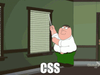

# Ali Fares-Boulos @alisarf
__Pronouns__ 
:woman: She/her/hers  

__Hobbies__ 
🚴 Biking 
🍝 Cooking 
🌏 Traveling 

## Current Project
__Acuity Dependent Staffing Matrix__ 🧬 
A web application for hospitals to configure Q4 staffing needs based on individual patient acuity. 
https://github.com/alisarf/Acuity-Dependent-Staffing-Matrix

__Thwart Me__ 🎮 
An oppurtunity for gamers to find new meaning in some of their favorite games.  
In collaboration with @Matthew-Beasley

 __Where to Find Me__ 
alifaresboulos@gmail.com  
https://alisarfaresboulos.com/ 

  
 More of my favorite memes [here](https://www.pinterest.com/alifares8/dev-memes/)...   

<!--
**alisarf/alisarf** is a ✨ _special_ ✨ repository because its `README.md` (this file) appears on your GitHub profile.

Here are some ideas to get you started:

- 🔭 I’m currently working on ...
- 🌱 I’m currently learning ...
- 👯 I’m looking to collaborate on ...
- 🤔 I’m looking for help with ...
- 💬 Ask me about ...
- 📫 How to reach me: ...
- 😄 Pronouns: ...
- ⚡ Fun fact: ...
-->
